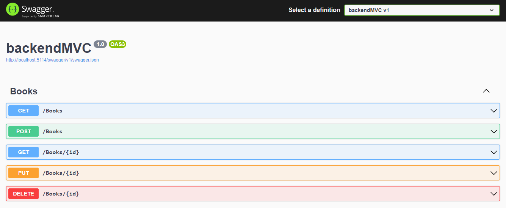

Prueba Backend 

Para instalar lo necesario
dotnet restore

Para correrlo
dotnet run 

Al correrlo la documentación de como usar la api se puede ver en ésta URL: 

http://localhost:5114/swagger/index.html

(o el localhost generado al correrla)

